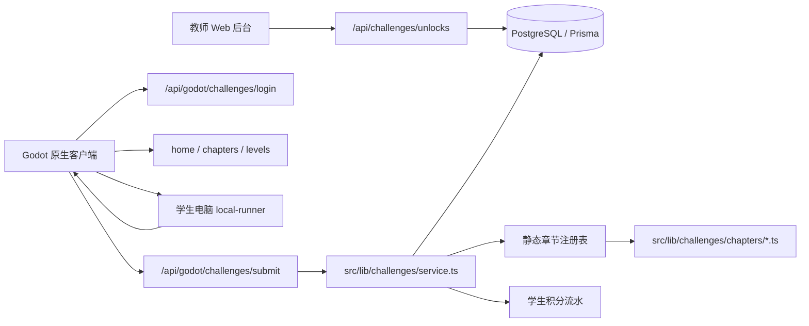
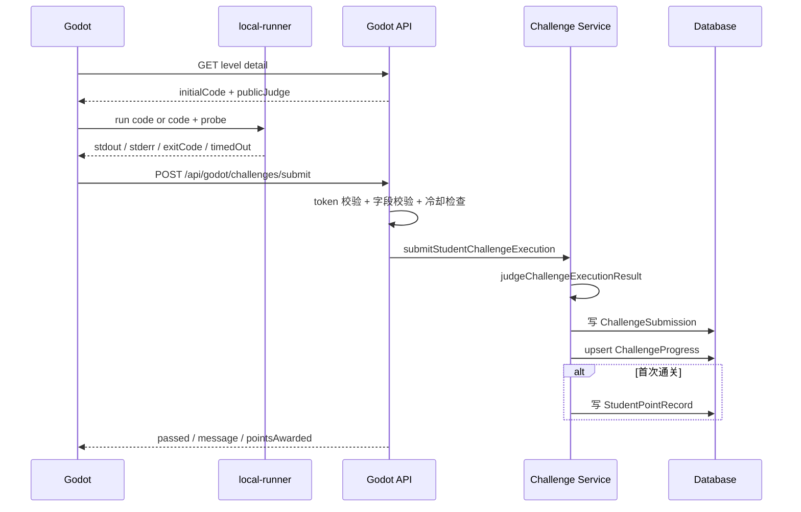

# 代码闯关设计说明

本文档用于帮助新接手的人快速理解当前“代码闯关”的原理、运行模式和扩展方式。它描述的是当前主链路：Godot 原生客户端负责展示和本地执行 Python，服务端负责账号、开放控制、私有判题、进度、积分和记录。

已有更细的接口文档见 `docs/godot-challenges-api.md`。本文更偏系统设计和代码组织。

## 1. 当前定位

代码闯关是一个面向学生的 Python 练习系统。它把课程内容组织成“章节”和“关卡”，每个关卡给出初始代码、任务说明、判题规则和积分。学生在 Godot 客户端中编写代码，本地运行后提交执行结果，服务端根据私有判题配置判断是否通关。

当前关键约束：

- 学生网页端入口已经停用，`/student/challenges` 及其子页面直接 `notFound()`。
- 普通网页提交接口 `/api/challenges/submit` 已禁用，只返回 403。
- Godot 原生客户端使用 `/api/godot/challenges/*` Bearer API。
- 服务端不会执行学生 Python，也不会把标准答案直接下发给 Godot。
- 学生本地机器不是强可信环境，现方案主要防止低成本作弊，不能防止有意抓包伪造执行结果。

## 2. 总体架构



核心分工：

- `src/lib/challenges/chapters/*.ts`：静态题库，定义章节、关卡、初始代码和私有判题配置。
- `src/lib/challenges/registry.ts`：章节注册表，对外提供按 key 查询章节和关卡。
- `src/lib/challenges/service.ts`：当前主业务服务，负责视图组装、解锁计算、Godot 公开判题提示、服务端判定、提交落库和积分发放。
- `src/lib/godot-challenges/auth.ts`：Godot 原生客户端登录和 Bearer token 校验。
- `src/app/api/godot/challenges/*`：Godot API。
- `src/app/teacher/challenges/*`：教师后台，负责班级维度开放任务、查看进度、发放 Py点。
- `prisma/schema.prisma`：进度、提交、开放状态、冷却等数据模型。

## 3. 领域模型

### 3.1 章节和关卡

章节与关卡是代码内静态定义，不在数据库中编辑。基础类型在 `src/lib/challenges/types.ts`：

- `ChallengeChapterDefinition`：章节，包含 `key`、`title`、`theme`、`description`、`helpDoc`、`levels`。
- `ChallengeLevelDefinition`：关卡，包含 `key`、`title`、`summary`、`description`、`points`、`initialCode`、`judge`。
- `ChallengeJudgeConfig`：判题配置，目前支持 `VARIABLES` 和 `OUTPUT` 两种模式。

当前注册的章节：

| key | 标题 | 主题 | 关卡数 | 主要判题模式 |
| --- | --- | --- | ---: | --- |
| `list-milk-tea` | 经营奶茶店 | Python 列表 | 8 | 变量判题为主，末关输出判题 |
| `sequence-set-camp` | 数据特工训练营 | 序列与集合 | 8 | 变量判题 |
| `space-market-adventure` | 星际集市大冒险 | Python 综合闯关 | 8 | 变量判题 |
| `robot-repair-station` | 机器人维修站 | Python 面向对象 | 8 | 变量判题 |

新增章节时，把章节定义文件放到 `src/lib/challenges/chapters/`，再在 `src/lib/challenges/registry.ts` 的 `chapters` 数组中注册即可。

### 3.2 数据库表

代码闯关相关表在 `prisma/schema.prisma`：

- `ChallengeChapterUnlock`：班级维度的章节开放状态，唯一键为 `className + chapterKey`。
- `ChallengeLevelUnlock`：班级维度的关卡手动开放状态，唯一键为 `className + chapterKey + levelKey`。
- `ChallengeProgress`：学生在某关的聚合进度，记录状态、尝试次数、最新代码、最新判题消息、首次通关时间和已发积分。
- `ChallengeSubmission`：每次提交的流水，保存代码、是否通过、stdout、stderr、判题消息和本次发放积分。
- `ChallengeSubmitCooldown`：学生提交冷却，当前冷却为 10 秒。
- `StudentPointRecord`：首次通关发放的普通积分流水。
- `StudentPyPointRecord`：Godot 求助 AI 的 Py点流水。

`ChallengeProgress` 是“当前状态”，`ChallengeSubmission` 是“历史审计”。展示进度时读前者，导出和追溯时读后者。

## 4. 解锁模式

解锁由两层规则共同决定：

1. 章节必须先对学生所在班级开放。
2. 章节开放后，关卡按顺序自然解锁；如果教师手动开放某一关，该关也可以提前进入。

实现入口是 `buildLevelAccessState()`。它会根据以下数据计算每关状态：

- `ChallengeChapterUnlock`：本班是否开放章节。
- `ChallengeLevelUnlock`：本班哪些关卡被手动开放。
- `ChallengeProgress`：学生前面关卡是否已 `PASSED`。

因此，学生看到的 `isAccessible` 不是数据库单字段，而是“章节开放 + 顺序通关状态 + 手动开放状态”的计算结果。

教师后台对应页面：

- `/teacher/challenges`：按班级查看全部章节，批量发放 Py点。
- `/teacher/challenges/[chapterKey]`：开放或关闭章节，手动开放具体关卡，查看本班学生通关排行。

## 5. 判题模式

### 5.1 变量判题 `VARIABLES`

变量判题适合“把结果保存到指定变量”的题目。关卡配置示意：

```ts
judge: {
  mode: 'VARIABLES',
  expectedVariables: {
    orders: ['珍珠奶茶', '杨枝甘露'],
    count: 2,
  },
}
```

Godot 获取关卡详情时，服务端不会返回 `expectedVariables`，而是返回 `publicJudge`：

- `mode: "VARIABLES"`
- `variableNames`：需要采集的变量名
- `variableProbeScript`：可以追加到学生代码后执行的变量探针脚本
- `variableStartMarker` / `variableEndMarker`：stdout 中包裹变量 JSON 的标记

执行过程：

1. Godot 把学生代码和 `variableProbeScript` 拼接。
2. local-runner 在学生电脑上运行 Python。
3. 探针脚本从 `globals()` 中读取指定变量。
4. 探针把变量结果序列化为 JSON，并写到 stdout 的 marker 之间。
5. Godot 可以直接提交带 marker 的 stdout，也可以自行解析成 `execution.variables` 后提交。
6. 服务端解析变量结果，并和私有 `expectedVariables` 深度比较。

变量规范化规则：

- `set` 会转成排序后的列表，避免集合无序导致误判。
- `tuple` 会转成列表。
- `list` 保持列表结构并递归规范化。
- `dict` 的 key 会转成字符串，value 递归规范化。
- 不能 JSON 化的对象会以 `repr()` 记录，并标记 `nonJson`，判题时视为不可判定。

比较规则由 `challengeValuesEqual()` 实现。数组要求长度和顺序一致；对象会先按 key 排序，再递归比较。

### 5.2 输出判题 `OUTPUT`

输出判题适合要求打印固定内容的题目。关卡配置示意：

```ts
judge: {
  mode: 'OUTPUT',
  expectedOutput: `第一行
第二行`,
}
```

服务端比较时会统一换行符并 `trim()`：

- `\r\n` 转成 `\n`
- 忽略首尾空白
- 中间内容、顺序和格式必须一致

## 6. 提交流程



提交接口不会信任客户端传来的 `passed`。客户端只提交代码和执行结果，服务端用私有判题配置重新判定。

服务端提交事务做三件事：

1. 写入 `ChallengeSubmission`，保留本次提交完整审计记录。
2. upsert `ChallengeProgress`，更新最新代码、最新输出、尝试次数、状态和通关时间。
3. 如果是首次通关且关卡有积分，写入 `StudentPointRecord`，并返回本次 `pointsAwarded`。

同一关重复通关不会重复发普通积分，因为 `isFirstPass` 依赖 `existingProgress.firstPassedAt`。

## 7. API 模式

Godot 原生客户端 API 全部走 Bearer token。登录接口：

- `POST /api/godot/challenges/login`

登录后常用接口：

- `GET /api/godot/challenges/me`
- `GET /api/godot/challenges/home`
- `GET /api/godot/challenges/chapters/{chapterKey}`
- `GET /api/godot/challenges/chapters/{chapterKey}/levels/{levelKey}`
- `POST /api/godot/challenges/submit`
- `GET /api/godot/challenges/py-points`
- `POST /api/godot/challenges/py-points/consume`

教师 Web API：

- `GET /api/challenges/unlocks`
- `PUT /api/challenges/unlocks`
- `GET /api/challenges/export`
- `POST /api/py-points`

旧接口状态：

- `POST /api/challenges/submit`：已禁用，返回“代码闯关仅允许通过 Godot 原生客户端提交”。
- `/student/challenges`：已禁用，页面返回 404。
- 旧 Godot WebView 登录或交换接口已停用，见 `docs/godot-challenges-api.md`。

## 8. Py点模式

Py点用于 Godot 客户端的“求助 AI”额度。服务端不直接处理 AI 请求，只处理余额和流水。

关键设计：

- 教师可以在 `/teacher/challenges` 给当前班级批量增加 Py点。
- Godot 通过 `GET /api/godot/challenges/py-points` 查询余额。
- Godot 通过 `POST /api/godot/challenges/py-points/consume` 扣除额度。
- 扣除接口支持 `requestId`，同一个请求 ID 重试不会重复扣点。
- Py点流水写入 `StudentPyPointRecord`，普通通关积分写入 `StudentPointRecord`，两套积分独立。

## 9. 安全边界

当前方案做到了：

- 标准答案不下发到客户端。
- 客户端不提交 `passed: true`，服务端重新判定。
- 服务端记录每次代码、输出、错误、结果和时间。
- 服务端限制 10 秒提交冷却，减少频繁刷提交。
- 首次通关积分在数据库事务内发放，避免重复发放。

当前方案没有做到：

- 不能证明 stdout 一定来自真实 local-runner。
- 不能证明 Godot 客户端没有被修改。
- 不能防止学生绕过客户端直接构造 API 请求。

如果后续通关积分进入高价值排名，可以考虑增加：

- local-runner 对执行结果签名。
- 服务端发放一次性 nonce，执行结果必须带 nonce。
- 设备绑定或课堂局域网绑定。
- 服务端沙箱判题，但需要额外处理资源隔离和安全问题。

## 10. 扩展新关卡的步骤

新增关卡通常不需要改数据库。

1. 在对应章节文件的 `levels` 数组中添加 `ChallengeLevelDefinition`。
2. 确定唯一的 `level.key`，一旦上线不要随意修改，否则历史进度无法自动对应。
3. 写清楚 `title`、`summary`、`description`、`points` 和 `initialCode`。
4. 选择判题模式：
   - 学生只需保存变量结果，优先用 `VARIABLES`。
   - 学生必须练习打印格式，才用 `OUTPUT`。
5. 给 `VARIABLES` 题目设计 JSON 可表示的预期值，避免要求复杂对象实例直接作为答案。
6. 本地用学生视角跑通：进入关卡、运行、提交、失败提示、成功通关、下一关解锁。
7. 用教师视角确认：班级开放、手动开放、进度统计、导出提交记录。

新增章节时，再额外做两步：

1. 新建 `src/lib/challenges/chapters/<chapter>.ts`。
2. 在 `src/lib/challenges/registry.ts` 导入并加入 `chapters` 数组。

## 11. 维护注意点

- `chapterKey` 和 `levelKey` 是进度、提交、开放状态的业务主键，改名会影响历史数据。
- `points` 只影响首次通关时的发放；已发过的历史积分不会自动重算。
- `ChallengeSubmission` 可以增长很快，长期使用后可能需要按班级、章节或时间做归档策略。
- `src/lib/challenges/judge.ts` 和 `src/lib/challenges/client-judge.ts` 保留了早期服务端或网页本地运行判题能力，但当前主提交链路是 Godot API + `service.ts`。
- 变量探针 marker 使用固定字符串，解析时取 stdout 中最后一组 marker，学生自己的输出会从最终记录的 stdout 中剔除探针片段。
- `CHALLENGE_SUBMIT_COOLDOWN_SECONDS` 当前为 10 秒，位置在 `src/lib/challenges/cooldown-config.ts`。

## 12. 快速代码索引

| 主题 | 文件 |
| --- | --- |
| 类型定义 | `src/lib/challenges/types.ts` |
| 章节注册 | `src/lib/challenges/registry.ts` |
| 当前主业务服务 | `src/lib/challenges/service.ts` |
| Godot 鉴权 | `src/lib/godot-challenges/auth.ts` |
| Godot 提交 API | `src/app/api/godot/challenges/submit/route.ts` |
| Godot 章节/关卡 API | `src/app/api/godot/challenges/chapters/[chapterKey]/**` |
| 教师闯关首页 | `src/app/teacher/challenges/page.tsx` |
| 教师开放控制 | `src/app/teacher/challenges/ChallengeUnlockManager.tsx` |
| Py点批量发放 | `src/app/teacher/challenges/ChallengePyPointGrantPanel.tsx` |
| 数据模型 | `prisma/schema.prisma` |
| Godot API 明细 | `docs/godot-challenges-api.md` |
